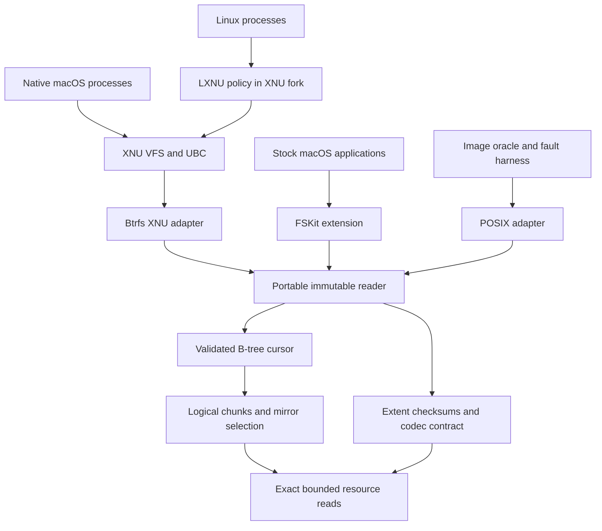

# Architecture

## Ownership and data flow

The core owns disk interpretation, chunk mapping, tree order and generation
checks, namespace records, extent selection and checksum policy. Adapters own
allocation, native object lifetime, scheduling, authorization, codec providers
and page-cache integration. No Foundation, vnode, errno or LXNU type crosses the
core API. Linux is an independent test oracle, never the runtime implementation.

`core/disk.h` expresses named little-endian byte-array fields. Their alignment is
one on every architecture; compile-time layout assertions guard the documented
wire format. There are no casts to native unaligned integer pointers.

## Immutable mount contract

The owner supplies a fixed-size resource that remains unchanged for the mount
lifetime. Exact-read callbacks either fill the entire requested range or fail;
the core checks bounds first. Allocate/release are paired with exact sizes.
The environment has no write operation. Mount, mirror fallback, reads and unmount
cannot repair media or replay a pending tree log.

Only the primary superblock is admitted. Automatic selection of an older mirror
could silently roll back acknowledged data and is not a mount fallback. Unknown
incompatible features, alternate checksum algorithms, seeding/metadump formats,
multiple devices and pending logs have explicit results. Unknown read-only
compatible bits are admissible only because there is no write capability.

The superblock bootstraps SYSTEM chunks. The chunk-tree scan validates full
mapping records and reconciles the bootstrap copies exactly before publication.
Chunk ranges cannot overlap logically; DUP copies cannot alias one another.
Device ID and UUID, physical bounds, alignment, profile and extent-tree owner
are checked. Metadata and data use their respective chunk classes.

A cursor retains one heap buffer per tree level. Internal keys are numerically
ordered by object ID, type and offset. Each child must match its parent's first
key and generation, remain below ancestor upper bounds and decrease the level.
Each block verifies checksum, filesystem identity, bytenr, owner and item ranges.
File-tree blocks may retain the originating subvolume owner after a snapshot;
system-tree ownership must match exactly. This is not an extent-backreference
scrub and must not be described as one.

The complete chunk map and selected root descriptor become immutable when mount
succeeds. Each operation owns its cursor buffers. Independent operations may run
concurrently if the adapter's read/allocation services support it; they require
no mount-wide read lock. The adapter must drain them before unmount. The current
API accepts inode snapshots obtained from this mount, not arbitrary forged or
cross-mount structs. A writer will need explicitly versioned operation views.

## Identity and namespaces

Core identity is always `(tree ID, inode ID)`. Snapshots can share both inode
numbers and backing blocks while remaining distinct objects. Default subvolume
selection follows the root tree's `default` entry; explicit tree 5 exposes the top
level. Crossing a subvolume directory entry resolves a new root, preserving its
identity and generation. Symlink payload reading is separate from platform namei.

Lookup hashes raw names using Btrfs's CRC32C name hash, then compares full byte
strings and validates collision records. Enumeration uses persistent DIR_INDEX
keys as resumable cookies, never packed-buffer offsets. A failed operation leaves
the caller's cookie unchanged. The streaming API retains its cursor across entries;
adapters add any native dot entries themselves. Lookup handles `.` and `..`.
Parent resolution uses inode references within a tree and root backreferences
across subvolumes; the selected mount root remains its own parent. This does not
implement Linux path-walk, symlink resolution or authorization policy.

Xattr names use separate validation: they are raw namespace keys and may contain
`/`, while directory components may not. Embedded NUL and excess length are
rejected in both. Linux namespace authorization is outside this parser.

The shared native identity table assigns mount-local IDs without truncation or
hash collisions. Root is 2; every new pair gets a never-reused ID. Mappings survive
FSItem/vnode reclaim until unmount. Native persistent-filehandle capability must
remain disabled. The native adapter serializes table access; table allocation
failure cannot publish an alias. Exhaustion is an explicit error.

## Data integrity and I/O cost

Regular file reads reuse extent and checksum paths through an operation. Device
I/O is coalesced into windows up to 1 MiB. Checksums consume full stored sectors,
including edges outside a small requested byte range, before that window becomes
visible to its caller. An I/O failure or checksum mismatch may retry a DUP copy
with the same logical identity; no repair is written. A successful prefix before
a later failure is reported explicitly; bytes beyond `completed` are invalid.

Inline data is protected by its leaf checksum. Sparse holes and unwritten
preallocation return zeroes. Shared regular extents honor the recorded extent
offset, not just disk_bytenr. Compressed extents verify their stored bytes before
calling the adapter codec; input and decoded allocation are bounded independently.
An absent codec returns unsupported. NODATASUM is honored as an explicit on-disk
contract; it must not be confused with verified data.

CRC32C uses ARM CRC instructions when the selected target guarantees them,
otherwise an immutable table. Kernel acceleration uses general registers only.
There is no CPU feature probe, lazy global initialization or kernel SIMD use.

FSKit inhibits offloaded I/O so data passes through the core. XNU retains UBC as
the only native file-page cache. Its blockmap uses file-logical strategy addresses;
strategy reads/verifies through the core before completing a buffer. It never
passes those synthetic addresses to the device. UBC integration is compilation
evidence until actual mmap, pagein, EOF, error and reclaim tests pass in a guest.

## Bounds

| Resource | Current limit | Exceeding it |
| --- | --- | --- |
| Tree levels | 8 (levels 0 through 7) | Corrupt format |
| Node/sector size | powers of two, 4 through 64 KiB; node >= sector | Corrupt geometry |
| Chunks | 4096 | Unsupported capacity |
| Regular read window | 1 MiB per operation | Split into windows |
| Compressed input/output | 128 KiB each | Corrupt extent |
| Traversed file/xattr records per operation | 1,048,576 | Unsupported capacity |
| Native identities per mount | 65,536 | Explicit range error |

The chunk table consumes a fixed bounded allocation; cursors allocate only the
levels they visit. Kernel-stack compilation enforces 2 KiB frames. These limits
are development contracts, not a claim that all valid Linux volumes fit them.

## Write architecture to preserve

Use Btrfs CoW transactions, not an ext4 journal transplanted into Btrfs. Separate
an immutable committed view, a transaction's private root set, extent reservation,
reference accounting, dirty tree blocks and device persistence. Mutations return
only after their chosen visibility contract is met; fsync must have a real durable
commit or a correctly implemented tree-log contract. The first writer may use a
full-tree commit for fsync, with measured cost and no pretend log support.

Never overwrite blocks referenced by the committed root set or a live snapshot.
Persist new file data, new checksums/backreferences and CoW metadata bottom-up;
flush them before publishing a superblock root set, then flush the publication.
Account for torn sectors and inconsistent super mirrors. Reuse is forbidden until
all durable roots and pinned readers release a range. Allocation failure before
publication rolls back privately. An uncertain write/flush poisons the writer,
retaining recovery evidence. See the specific crash oracle in HANDOFF.md.

## Primary format references

- [Btrfs on-disk format](https://btrfs.readthedocs.io/en/stable/dev/On-disk-format.html)
  is explicitly incomplete; check modern field layouts against the UAPI.
- [Linux Btrfs UAPI structures](https://github.com/torvalds/linux/blob/v6.12/include/uapi/linux/btrfs_tree.h)
  define the wire constants and structures used here.
- [Btrfs tree design](https://btrfs.readthedocs.io/en/latest/dev/dev-btrfs-design.html)
  describes CoW roots, extent sharing and transaction publication.
- [Apple FSKit](https://developer.apple.com/documentation/fskit) defines the stock
  macOS boundary; the selected Xcode SDK headers are the build authority.
