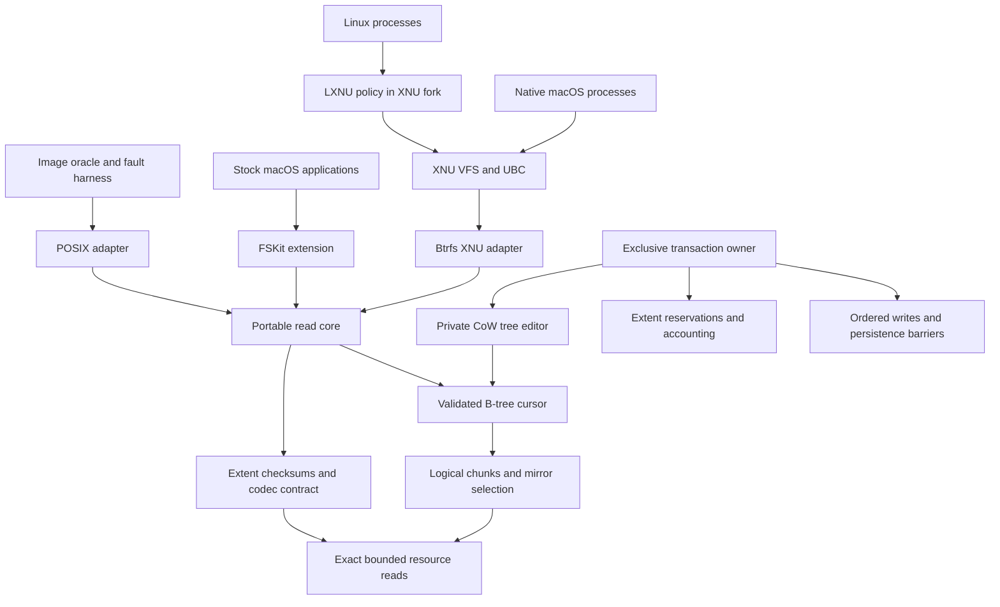

# Architecture

## Ownership and data flow

The core owns disk interpretation, chunk mapping, tree order and generation
checks, namespace records, extent selection and checksum policy. Adapters own
allocation, native object lifetime, scheduling, authorization, codec providers
and page-cache integration. No Foundation, vnode, errno or LXNU type crosses the
core API. Linux is an independent test oracle, never the runtime implementation.

`core/disk.h` expresses named little-endian byte-array fields. Their alignment is
one on every architecture; compile-time layout assertions guard the documented
wire format. There are no casts to native unaligned integer pointers.

## Immutable mount contract

The owner supplies a fixed-size resource that remains unchanged for the mount
lifetime. Exact-read callbacks either fill the entire requested range or fail;
the core checks bounds first. Allocate/release are paired with exact sizes.
The read environment has no write operation. Mount, mirror fallback, reads and unmount
cannot repair media or replay a pending tree log.

Only the primary superblock is admitted. Automatic selection of an older mirror
could silently roll back acknowledged data and is not a mount fallback. Unknown
incompatible features, alternate checksum algorithms, seeding/metadump formats,
multiple devices and pending logs have explicit results. Unknown read-only
compatible bits are admissible to the immutable reader only; transaction admission
rejects them until their write semantics are implemented.

The superblock bootstraps SYSTEM chunks. The chunk-tree scan validates full
mapping records and reconciles the bootstrap copies exactly before publication.
Chunk ranges cannot overlap logically; DUP copies cannot alias one another.
Device ID and UUID, physical bounds, alignment, profile and extent-tree owner
are checked. Metadata and data use their respective chunk classes.

A cursor retains one heap buffer per tree level. Internal keys are numerically
ordered by object ID, type and offset. Each child must match its parent's first
key and generation, remain below ancestor upper bounds and decrease the level.
Each block verifies checksum, filesystem identity, bytenr, owner and item ranges.
File-tree blocks may retain the originating subvolume owner after a snapshot;
system-tree ownership must match exactly. This is not an extent-backreference
scrub and must not be described as one.

The complete chunk map and selected root descriptor become immutable when mount
succeeds. Each operation owns its cursor buffers. Independent operations may run
concurrently if the adapter's read/allocation services support it; they require
no mount-wide read lock. The adapter must drain them before unmount. The current
API accepts inode snapshots obtained from this mount, not arbitrary forged or
cross-mount structs. A writer will need explicitly versioned operation views.

## Identity and namespaces

Core identity is always `(tree ID, inode ID)`. Snapshots can share both inode
numbers and backing blocks while remaining distinct objects. Default subvolume
selection follows the root tree's `default` entry; explicit tree 5 exposes the top
level. Crossing a subvolume directory entry resolves a new root, preserving its
identity and generation. Symlink payload reading is separate from platform namei.

Lookup hashes raw names using Btrfs's CRC32C name hash, then compares full byte
strings and validates collision records. Enumeration uses persistent DIR_INDEX
keys as resumable cookies, never packed-buffer offsets. A failed operation leaves
the caller's cookie unchanged. The streaming API retains its cursor across entries;
adapters add any native dot entries themselves. Lookup handles `.` and `..`.
Parent resolution uses inode references within a tree and root backreferences
across subvolumes; the selected mount root remains its own parent. This does not
implement Linux path-walk, symlink resolution or authorization policy.

Xattr names use separate validation: they are raw namespace keys and may contain
`/`, while directory components may not. Embedded NUL and excess length are
rejected in both. Linux namespace authorization is outside this parser.

The shared native identity table assigns mount-local IDs without truncation or
hash collisions. Root is 2; every new pair gets a never-reused ID. Mappings survive
FSItem/vnode reclaim until unmount. Native persistent-filehandle capability must
remain disabled. The native adapter serializes table access; table allocation
failure cannot publish an alias. Exhaustion is an explicit error.

## Data integrity and I/O cost

Regular file reads reuse extent and checksum paths through an operation. Device
I/O is coalesced into windows up to 1 MiB. Checksums consume full stored sectors,
including edges outside a small requested byte range, before that window becomes
visible to its caller. An I/O failure or checksum mismatch may retry a DUP copy
with the same logical identity; no repair is written. A successful prefix before
a later failure is reported explicitly; bytes beyond `completed` are invalid.

Inline data is protected by its leaf checksum. Sparse holes and unwritten
preallocation return zeroes. Shared regular extents honor the recorded extent
offset, not just disk_bytenr. Compressed extents verify their stored bytes before
calling the adapter codec; input and decoded allocation are bounded independently.
An absent codec returns unsupported. NODATASUM is honored as an explicit on-disk
contract; it must not be confused with verified data.

CRC32C uses ARM CRC instructions when the selected target guarantees them,
otherwise an immutable table. Kernel acceleration uses general registers only.
There is no CPU feature probe, lazy global initialization or kernel SIMD use.

FSKit inhibits offloaded I/O so data passes through the core. XNU retains UBC as
the only native file-page cache. Its blockmap uses file-logical strategy addresses;
strategy reads/verifies through the core before completing a buffer. It never
passes those synthetic addresses to the device. The read-only guest suite verifies mmap, descriptor-close lifetime, EOF and
concurrent reads. Failed pagein and forced reclaim/unmount remain separate gates.
XNU device requests use private synchronous buffers and coalesced aligned ranges;
only unaligned edges need a one-block bounce buffer. A bounded kernel zlib provider
uses exported inflate APIs and paired kernel allocation callbacks.

## Bounds

| Resource | Current limit | Exceeding it |
| --- | --- | --- |
| Tree levels | 8 (levels 0 through 7) | Corrupt format |
| Node/sector size | powers of two, 4 through 64 KiB; node >= sector | Corrupt geometry |
| Chunks | 4096 | Unsupported capacity |
| Regular read window | 1 MiB per operation | Split into windows |
| Compressed input/output | 128 KiB each | Corrupt extent |
| Traversed file/xattr records per operation | 1,048,576 | Unsupported capacity |
| Native identities per mount | 65,536 | Explicit range error |

The chunk table consumes a fixed bounded allocation; cursors allocate only the
levels they visit. Kernel-stack compilation enforces 2 KiB frames. These limits
are development contracts, not a claim that all valid Linux volumes fit them.

## Write architecture

`core/mutable.c` owns a private metadata overlay. It CoWs only modified paths,
keeps dirty nodes in logical/physical hash indexes, and reuses scratch space and
path buffers. Variable-size insertion may produce two or three leaves; pointer
splits propagate upward. Deletion removes empty children and collapses unary
roots; underfull sibling merging remains open. Fixed-size replacements avoid
whole-node repacking. The original root and bytes remain immutable. A failed
edit poisons the context; sealing computes checksums, and accepting transfers
reservations only after the owning transaction's durable publication.

`core/space.c` reads the extent tree in one ordered pass merged with the sorted
chunk map. Every extent and block-group record must lie inside a chunk; extents
must be aligned, disjoint and bounded by their chunk, and each chunk's extents must
sum to its block-group total. It rejects physical chunk aliases, removes
superblock stripes from candidate gaps, and produces bounded metadata reservations.
It pins the committed allocation map for the whole transaction and never reuses a
released reservation within that transaction. Gap storage grows from 256 records
to a maximum of 131,072. The current transaction limit is 4,096 dirty nodes; the
standalone editor supports up to 65,536. Exhausted reservations return NO_SPACE
from the failing edit, before any media write.

`core/transaction.c` owns the private root set and a separate write environment.
Its current operation is replacing an existing uncompressed inline regular file,
up to 2 KiB, in any writable file tree: the top level, subvolumes and writable
snapshots. Read-only snapshots return READ_ONLY; dead or partially dropped trees
are unsupported. Empty replacement removes the inline extent. One transaction may
replace many inodes in up to 16 trees. It updates inode and root change metadata,
tree references, block-group totals, root items and backup roots. Accounting
changes may CoW the extent/root trees; a bounded fixed point resolves those
allocations before the first media write.

## Shared references

Snapshots and reflinks share tree blocks and data extents. `core/backref.c`
edits extent items in the private extent tree with Linux's exact representation:
tree references name a root, shared block references name a parent block, data
references name (root, inode, file offset minus extent offset) with a count, and
shared data references name a parent leaf with a count. Inline references are
ordered by type and by descending root/parent or data-reference hash. A new
reference is keyed instead of inline when the item would reach Linux's maximum
inline extent item size or any keyed reference of that extent already exists;
keyed data references probe upward from their hash. A reference count reaching
zero deletes the extent item.

At accounting time every CoW of a committed block applies Linux's
`update_ref_for_cow` decision in creation order, which is parent before child:

- a block can be shared if it is in a file tree, is not that tree's root and is
  no newer than the tree's last snapshot (or carries the relocation flag);
- when the owning tree CoWs a shared block without FULL_BACKREF, the old block's
  children gain references naming it as parent and it gains FULL_BACKREF;
- when another tree CoWs a shared block, or the block already has FULL_BACKREF,
  its children gain references from the CoWing tree;
- an unshared FULL_BACKREF block converts its children back to tree references;
- the old block then loses the CoWing tree's reference and is freed only when
  that was its last one.

Children are read from the immutable committed block, which is the copy's
content at CoW time. Every change is applied before any media write, so the
ordering Linux obtains from its delayed-reference heads (additions before drops)
is preserved without a persistent queue. Any inconsistency, such as a missing
reference, a shared block in an unshareable position, or a sole implicit
reference not owned by the CoWing tree, fails the transaction before writing.
Root `bytes_used` changes by one node per new block and per CoW'd original, as
Linux records it for snapshots.

## File data

`btrfs_transaction_write` and `btrfs_transaction_truncate` change regular files
as copy-on-write data on filesystems with NO_HOLES (`core/data.c`). The range is
widened to whole sectors; partially covered sectors are read through a private
view (mutation metadata overlay, staged data, the transaction's own checksum and
file trees, and the adapter's codec), so later operations see earlier ones and
compressed or preallocated input reads correctly. Existing coverage is removed
the way `btrfs_drop_extents` does: covered items go, overlapping ones are
trimmed, moved or split, keeping the reference key (file offset minus extent
offset). New extents come from data block-group gaps, at most 128 MiB each, with
a data extent item carrying the first reference inline, checksum items unless
the inode is NODATASUM, and a regular file extent item. Inline files become
regular extents. A write past an unaligned EOF clears the old EOF sector's tail;
truncation clears the new EOF sector's tail and drops coverage beyond it. Inode
size, `nbytes`, times, transid and sequence change together.

New data stays in memory (at most 64 MiB and 4,096 extents per transaction) and
is written during commit before the metadata, ahead of the first barrier, so a
destroyed transaction leaves media untouched and a crash leaves new data
unreferenced. File extent reference changes are queued and applied after the
CoW-derived references of the same commit, additions before drops. A data
extent losing its last reference loses its checksum items and block-group space
in the same commit; ranges freed or allocated in a transaction are never reused
by it, and the owner must retire readers of the old root before the next one.
Preallocated ranges are rewritten by CoW, not converted in place; NODATACOW files
are also written by CoW; data is never compressed on write. Set-id, immutable
and append-only inodes are refused until their policy contracts exist.

## Superblock copies, publication and recovery

Linux maintains a superblock copy at 64 KiB, 64 MiB and 256 GiB when the copy
ends strictly before the device end. Copies differ only in their offset and
checksum. Admission requires at least two copies, each intact and identical to
the mounted primary; otherwise `begin` returns RECOVERY_REQUIRED. A disagreement
means an earlier publication was not resolved, and a new commit could reuse blocks
that a newer copy still references. Commit re-reads every copy and returns STALE
if any changed after `begin`.

The publisher writes new metadata bottom-up, then:

1. barrier: the new tree is durable but unreferenced;
2. secondary copies, barrier: the untouched primary still names the
   acknowledged generation;
3. primary copy, barrier: success is returned only after this barrier.

Between barriers the device may persist issued writes in any order and tear any
of them at sector granularity. At every crash point at least one intact copy
names the acknowledged generation or the new one, and every intact copy names a
complete durable tree. Exact write/flush callbacks are explicit capabilities.
Failure or uncertain persistence makes the transaction terminal. Pre-write
failures and destruction discard private state without changing media.

Mount reads only the primary, so a torn primary fails as CORRUPT and an older
mirror is never silently chosen. `btrfs_recover_supers` is the explicit,
exclusive recovery operation, matching `btrfs rescue super-recover`: it selects
the newest checksum-valid copy, requires same-generation copies to agree, and
refuses a selection below the caller's acknowledged generation (STALE), a pending
tree log (UNSUPPORTED) or a copy with another filesystem identity (CORRUPT).
Before writing, it opens the selection's chunk, root, checksum, top-level, device
and extent trees and allocation map; file trees are not scrubbed. It rewrites
only disagreeing copies, never the selected source, followed by one barrier.
Without a writer it reports the decision and returns RECOVERY_REQUIRED.

The owner must hold exclusive resource access, drain readers before commit and
retire the original mount after successful or uncertain publication. It must
record the generation of each acknowledged commit and pass it to recovery. Live
native read/write views, reader pins across commits, UBC dirty-page coherence and
native flush callbacks are not connected yet. Both native adapters remain
read-only and do not call recovery. Backup roots are rotating recovery hints, not
permanently pinned snapshots. See ACCEPTANCE.md for the exact crash oracle scope
and HANDOFF.md for the requirements before general writable mounts.

## Primary format references

- [Btrfs on-disk format](https://btrfs.readthedocs.io/en/stable/dev/On-disk-format.html)
  is explicitly incomplete; check modern field layouts against the UAPI.
- [Linux Btrfs UAPI structures](https://github.com/torvalds/linux/blob/v6.12/include/uapi/linux/btrfs_tree.h)
  define the wire constants and structures used here.
- [Btrfs tree design](https://btrfs.readthedocs.io/en/latest/dev/dev-btrfs-design.html)
  describes CoW roots, extent sharing and transaction publication.
- [Apple FSKit](https://developer.apple.com/documentation/fskit) defines the stock
  macOS boundary; the selected Xcode SDK headers are the build authority.
