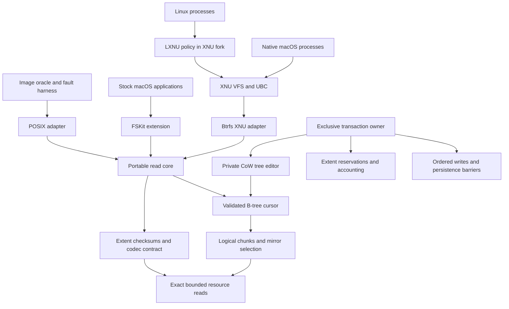

# Architecture

## Ownership and data flow

The core owns disk interpretation, chunk mapping, tree order and generation
checks, namespace records, extent selection and checksum policy. Adapters own
allocation, native object lifetime, scheduling, authorization, codec providers
and page-cache integration. No Foundation, vnode, errno or LXNU type crosses the
core API. Linux is an independent test oracle, never the runtime implementation.

`core/disk.h` expresses named little-endian byte-array fields. Their alignment is
one on every architecture; compile-time layout assertions guard the documented
wire format. There are no casts to native unaligned integer pointers.

## Immutable mount contract

The owner supplies a fixed-size resource that remains unchanged for the mount
lifetime. Exact-read callbacks either fill the entire requested range or fail;
the core checks bounds first. Allocate/release are paired with exact sizes.
The read environment has no write operation. Mount, mirror fallback, reads and unmount
cannot repair media or replay a pending tree log; a filesystem with one is
refused (RECOVERY_REQUIRED) rather than shown without its fsynced changes.

Only the primary superblock is admitted. Automatic selection of an older mirror
could silently roll back acknowledged data and is not a mount fallback. Unknown
incompatible features and checksum algorithms, seeding/metadump formats,
multiple devices and pending logs have explicit results. Unknown read-only
compatible bits are admissible to the immutable reader only; transaction admission
rejects them until their write semantics are implemented.

The superblock bootstraps SYSTEM chunks. The chunk-tree scan validates full
mapping records and reconciles the bootstrap copies exactly before publication.
Chunk ranges cannot overlap logically; DUP copies cannot alias one another.
Device ID and UUID, physical bounds, alignment, profile and extent-tree owner
are checked. Metadata and data use their respective chunk classes.

A cursor retains one heap buffer per tree level. Internal keys are numerically
ordered by object ID, type and offset. Each child must match its parent's first
key and generation, remain below ancestor upper bounds and decrease the level.
Each block verifies checksum, filesystem identity, bytenr, owner and item ranges.
File-tree blocks may retain the originating subvolume owner after a snapshot;
system-tree ownership must match exactly. This is not an extent-backreference
scrub and must not be described as one.

The complete chunk map and selected root descriptor become immutable when mount
succeeds. Each operation owns its cursor buffers. Independent operations may run
concurrently if the adapter's read/allocation services support it; they require
no mount-wide read lock. The adapter must drain them before unmount. The current
API accepts inode snapshots obtained from this mount, not arbitrary forged or
cross-mount structs. A writer will need explicitly versioned operation views.

## Identity and namespaces

Core identity is always `(tree ID, inode ID)`. Snapshots can share both inode
numbers and backing blocks while remaining distinct objects. Default subvolume
selection follows the root tree's `default` entry; explicit tree 5 exposes the top
level. Crossing a subvolume directory entry resolves a new root, preserving its
identity and generation, only when the containing tree's ROOT_REF names that
entry (directory and name), as Linux's `fixup_tree_root_location` requires.
Otherwise (an entry a snapshot copied, or one whose subvolume was deleted) it
resolves, as Linux's `new_simple_dir` presents it, to an empty stub directory:
inode `BTRFS_EMPTY_SUBVOLUME_INODE` (2) of the containing tree, mode 0755, one
link, no xattrs and no parent of its own (`btrfs_parent` reports NOT_FOUND;
adapters keep the path they came from). A deleted subvolume cannot be opened
(NOT_FOUND, Linux's ENOENT). Symlink payload reading is separate from platform
namei.

Lookup hashes raw names using Btrfs's CRC32C name hash, then compares full byte
strings and validates collision records. Enumeration uses persistent DIR_INDEX
keys as resumable cookies, never packed-buffer offsets. A failed operation leaves
the caller's cookie unchanged. The streaming API retains its cursor across entries,
and a second one for the inodes its entries name in the directory's tree, which
searches only its current leaf when that leaf spans the next inode; entries
naming another subvolume's root read it directly. Adapters add any native dot
entries themselves. Lookup handles `.` and `..`.
Parent resolution uses inode references within a tree and root backreferences
across subvolumes; the selected mount root remains its own parent. This does not
implement Linux path-walk, symlink resolution or authorization policy.

Xattr names use separate validation: they are raw namespace keys and may contain
`/`, while directory components may not. Embedded NUL and excess length are
rejected in both. Linux namespace authorization is outside this parser.

The shared native identity table assigns mount-local IDs without truncation or
hash collisions. Root is 2. A tree gets a slot the first time one of its objects
is numbered, the mount root's tree slot 0, and an object's number is
`slot << 48 | inode` for inode numbers from 256 below 2^48. Objects of the
mounted subvolume therefore report their Btrfs inode numbers, as Linux does,
and numbering them allocates nothing, so a mount names any number of objects.
Other subvolumes' objects have numbers at or above 2^48 (Linux distinguishes
them by device instead). Object IDs outside that range, and trees after 32,768
slots, get indirect numbers from 2^63, at most 65,536 per mount; exhaustion of
those is an explicit error. Numbers are never reused for another pair, and the
mapping is fixed until unmount, including after FSItem/vnode reclaim. Lookup
decodes any direct number of a tree with a slot; the adapter then reads the
object from disk, so an unused number is not found. Native persistent-
filehandle capability must remain disabled. The native adapter serializes table
access; allocation failure leaves the table unchanged and publishes no alias.
The XNU adapter sizes its node hash from the system's vnode limit. A legacy
readdir without extended entries carries 32-bit numbers; it fails with ERANGE at
an entry whose number does not fit instead of truncating it.

## Data integrity and I/O cost

Regular file reads reuse extent and checksum paths through an operation. Device
I/O is coalesced into requests up to 1 MiB. Whole sectors at sector-aligned file
positions are read into the caller's buffer and verified there; a range that
fails is zeroed before the call returns. Unaligned edges are read into a window,
where checksums consume full stored sectors before any byte is copied out. An
I/O failure or checksum mismatch may retry a DUP copy with the same logical
identity; no repair is written. A successful prefix before a later failure is
reported explicitly; bytes beyond `completed` are invalid and never hold
unverified file data.

An owner may give its mounts one bounded cache of verified tree nodes
(`btrfs_cache`, in the environment), shared across threads. Lookups take no
lock: a lookup raises a pin counter of the entry, one of sixteen chosen by its
stack address so that concurrent lookups of the same tree roots touch separate
cache lines, and then checks that the entry is not being replaced; storing a
node takes the owner's lock and replaces only an entry it finds unpinned in
every counter after marking it, both steps sequentially consistent so that one
side always sees the other. Address, generation and level name one immutable node: a block is
rewritten only after it is freed, and a reused address carries a newer
generation, so a hit returns the node without device I/O or checksum, after
the caller's owner check. Eight-way sets with CLOCK replacement bound each
lookup. Tree cursors read a stored node in place while they hold a pin on it,
so a hit copies nothing; a pinned node is never replaced, and a set whose ways
are all pinned stores nothing new until a pin is released. Open directory
streams hold their pins, so every stream must be closed and every mount
unmounted before the cache is destroyed.

Nodes enter the cache from committed views. After its primary superblock is
durable, an accepted transaction transfers its live node buffers to the cache
when its private editor is destroyed. This keeps the private view valid until
teardown and avoids copying each published node. Transfer requires the same
allocation/release callbacks and context; other allocators use a copy. Payload
buffers are allocated lazily. Up to eight retired buffers can be reused by the
next private editor; cached and spare buffers together stay within the configured
node-byte budget, with the same set count and lookup bound. A transaction's
private view
excludes its own generation; a refused or failed commit adds nothing, since the
next commit may reuse that generation and those addresses; explicit recovery
validates candidates without the cache, since a refused candidate's generation
may be written again. Within a transaction, the private view finds its own
nodes by logical address and checks their identity and item count; cursors on
the transaction's views read them in place, which holds because every such
cursor is closed before the transaction's next edit: an edit or seal while one
is open fails the transaction. Other cursors copy them. The
transaction checks each node's items once and computes its checksum when it
seals the nodes it will write, refusing the commit if any is malformed. The
cache is valid only while the device changes through its owner's commits; it
must be dropped when anything else changes the device.

Inline data is protected by its leaf checksum. Sparse holes, hole items and
unwritten preallocation return zeroes; a hole item may carry the nonzero offset
Linux leaves when it splits or trims one. Shared regular extents honor the recorded extent
offset, not just disk_bytenr. Compressed extents verify their stored bytes before
calling the adapter codec; input and decoded allocation are bounded independently.
zlib and Zstd extents reach the codec as one stream; the core cuts Btrfs's LZO
framing itself (a total length, then one LZO1X segment per sector, whose
32-bit header never crosses a sector boundary, as Linux's `fs/btrfs/lzo.c`
writes and checks it) and passes each segment on. A codec reports how many
bytes a stream decodes. An inline extent must decode to its recorded length
exactly; a regular extent's stream ends with the file's data, so a file whose
size is not a multiple of the sector size decodes short, and the rest of the
extent reads as zeros, as on Linux.
A shared cache with locks keeps up to sixteen decompressed extents, keyed by
stored range, codec, decoded size and the naming item's generation, so reads
within one extent decompress it once. Only committed generations are kept,
since a refused transaction's generation and space are used again; a
decompression of data read without checksum verification serves only reads that
skip it as well. An absent codec returns unsupported. NODATASUM is honored as an explicit on-disk
contract; it must not be confused with verified data.

CRC32C uses ARM CRC instructions when the selected target guarantees them and the
x86_64 CRC32 instruction (SSE4.2, present on every Intel Mac that runs the
supported macOS releases) on Apple x86_64 targets or when the target enables
SSE4.2; otherwise an immutable table. Data sectors are checksummed four at a
time in independent instruction chains, which hide the instruction latency that
bounds one chain. Kernel acceleration uses general registers only. There is no
CPU feature probe, lazy global initialization or kernel SIMD use.

The superblock's `checksum_type` selects one algorithm for the superblock, every
node and every data sector, as on Linux: CRC32C (4 bytes), XXH64 with seed zero
(8 bytes, little-endian), SHA-256 or unkeyed BLAKE2b-256 (32 bytes); an unknown
number is unsupported. `core/checksum.c` implements all four in general
registers. The checksum occupies the first bytes of a 32-byte field, the rest
zero when written and ignored when verified, as Linux compares only the
algorithm's length; checksum items hold one checksum of that length per sector,
and the per-item limit follows from it. The writer seals superblocks, nodes and
data checksums with the filesystem's algorithm, so every writer feature applies
to all four.
The arm64e kernel build uses `-mgeneral-regs-only`: `-mkernel` alone permits
compiler-generated NEON for copies and zeroing. A core header rejects ARM
kernel compilation with NEON enabled, including for inline memory primitives.

FSKit inhibits offloaded I/O so data passes through the core. The extension names
its type `machlinbtrfs` with subtype zero: Disk Arbitration appends `_fskit` to a
short name and cuts it at the first underscore. Probing returns `usable` for an
admitted volume, since Disk Arbitration rejects `usableButLimited`; whether a
volume accepts changes is decided when it loads, and on a read-only volume an
open for writing fails with EROFS before the kernel admits cached writes or
writable mappings. Enumeration without
attributes starts with `.` and `..` at cookies 0 and 1, below the first directory
index, and the mount root is its own parent; with attributes it has neither. An
entry whose inode is missing fails the enumeration with EIO instead of ending it.
Device reads check the resource's revocation, continue after partial reads, read
aligned ranges straight into the caller's buffer and bounce only unaligned ones.
Refused check and format requests complete through their task, as the system
clients expect. The preferred transfer size is 128 KiB. `tests/fskit_volume.m`
checks this through stand-ins for the framework's resource, packer and buffer;
it does not establish installed behavior.

XNU retains UBC as
the only native file-page cache. Its blockmap uses file-logical strategy addresses;
strategy reads/verifies through the core before completing a buffer. It never
passes those synthetic addresses to the device. The read-only guest suite verifies mmap, descriptor-close lifetime, EOF and
concurrent reads. Failed pagein and forced reclaim/unmount remain separate gates.
XNU device requests use private synchronous buffers and coalesced aligned ranges;
only unaligned edges need a one-block bounce buffer. A bounded kernel zlib provider
uses exported inflate APIs and paired kernel allocation callbacks. LZO1X and
Zstandard come from `adapters/common/codec.c`, freestanding decoders that every
adapter shares: they allocate nothing, take a 16 KiB table workspace for
Zstandard (a kernel allocation per call, per-thread storage in user space)
and decode Zstandard literals into the end of the output instead of a block
buffer. A frame is accepted only as libzstd, which Linux shares, accepts it
both as one buffer and as a stream; LZO1X follows Linux's decoder, which also
requires the three-byte end instruction.

## Bounds

| Resource | Current limit | Exceeding it |
| --- | --- | --- |
| Tree levels | 8 (levels 0 through 7) | Corrupt format |
| Node/sector size | powers of two, 4 through 64 KiB; node >= sector | Corrupt geometry |
| Chunks | 1,048,576; the table holds the chunks present | Unsupported capacity |
| Chunks one transaction grows | 64 | NO_SPACE until the next transaction |
| Regular read window | 1 MiB per operation | Split into windows |
| Compressed input/output | 128 KiB each | Corrupt extent |
| Traversed file/xattr records per operation | 1,048,576 | Unsupported capacity |
| Extent-tree items a transaction's chunk loads visit | metadata and system chunk bytes / 25-byte item header | Corrupt tree |
| Free ranges per allocation class | 131,072 | Unsupported capacity |
| Native identities per mount | 65,536 | Explicit range error |

The chunk table starts with four entries and doubles as the chunk tree and
the superblock array name more; a transaction copies it with room for the
chunks it may grow. Cursors allocate only the levels they visit. Kernel-stack compilation enforces 2 KiB frames. These limits
are development contracts, not a claim that all valid Linux volumes fit them.

## Write architecture

`core/mutable.c` owns a private metadata overlay. It CoWs only modified paths,
keeps dirty nodes in logical/physical hash indexes, and reuses scratch space and
path buffers. Variable-size insertion may produce two or three leaves; pointer
splits propagate upward. Deletion removes empty children and collapses unary
roots. An edited leaf below a third of its capacity, or node below a quarter of
its pointers, merges with its right sibling, else its left one, when both fit in
one node; the sibling is CoWed like any edited block and merges cascade upward.
Fixed-size replacements write the payload alone. An insertion, resize or
deletion that fits a leaf the transaction has already packed moves only the item
headers and data after the edited slot, leaving the bytes a full repack writes.
On CoW the editor recognizes tightly packed source leaves and clears only their
unused area, so their first edit can use this path too; valid source leaves with
gaps still use the general repacker. Packed-leaf occupancy comes from the last
payload offset in constant time instead of summing every item's size after each
edit. Exact item lookups on wholly private paths copy the value directly,
checking node identity, parent first keys and ancestor upper bounds without
creating cursor buffers or pins. Reaching an untouched node falls back to the
ordinary verified cursor. File-tree owner checks retain snapshot semantics.
Replacing a key and an equal-size value within the same packed leaf moves only
the interval between the old and new slots, once for headers and once for data.
Occupancy stays constant, avoiding the transient underfull leaf of a separate
delete and insert. A zero-size free-space item that keeps its slot changes only
its key. Crossing the leaf's ancestor bounds, changing payload size or editing
a gapped leaf falls back to the two ordinary bounded editor descents.
The original root and bytes remain immutable. A failed
edit poisons the context; sealing computes checksums, and accepting transfers
reservations only after the owning transaction's durable publication.

`core/space.c` reads every block group's item when a transaction starts and
loads a chunk's extents only when it needs them: when allocation reaches the
chunk, never skipping free space of a lower chunk of the class, so its choices
do not depend on which chunks are loaded, or when a change (a released block,
an unused-group check) touches it. System chunks load at once. A load is one
ordered pass from the previous chunk's end to the chunk's end: no extent or
block-group record may lie between chunks (nor beyond the last one, checked at
start), extents must be aligned, disjoint and bounded by their chunk, they must
sum to its block-group total, and its free runs must equal its free-space items.
Nothing is allocated in, or released into, a chunk before it is loaded. The
start rejects physical chunk aliases; a load removes superblock stripes from the
chunk's free ranges, and the allocator produces bounded metadata reservations.
Until a chunk loads, its free bytes come from its block-group total, so the
space checks see the whole class.
It pins the committed allocation map for the whole transaction and never reuses a
released reservation within that transaction. Free ranges are kept in canonical
form: sorted, and merged only within one chunk.

An owner may keep this state across its transactions (`btrfs_allocation_map`,
`btrfs_transaction_begin_mapped`); the native volume does. A transaction whose
base is the map's generation, filesystem and chunk map borrows it instead of
reading block groups and verifying the device tree again, and loads further
chunks as it needs them: the state was verified when it was loaded, and only
this owner's commits changed it since. A successful commit adds the chunks it
loaded, then replays into the map its grown chunks (free as a
whole, minus superblock stripes), its allocation log in order, its block-group
totals and its removed groups, and derives the device's free ranges from the
chunk map; a map that cannot follow is dropped, and any other base is loaded,
verified and saved. A failed or aborted transaction leaves the map at its
generation. Grouping many operations into one commit, with the reservations and
durability waits it needs, is designed in [group commit](GROUP_COMMIT.md).
Gap storage grows from 256 records
to a maximum of 131,072. The current transaction limit is 4,096 dirty nodes; the
standalone editor supports up to 65,536. Exhausted reservations return NO_SPACE
from the failing edit, before any media write. The commit's accounting fixed
point (extent items, block groups, free space and root items of the blocks the
edits copied) may still run out after every edit fitted; it too returns
NO_SPACE before any media write, the transaction is failed and the volume stays
usable.

Admission keeps that from happening, as Linux's block reserves do.
`btrfs_transaction_room` admits an operation of a declared node count only
while the metadata the transaction may need stays obtainable, from free
metadata or as growth from unallocated device space: twice the work so far and
the operation's, the commit's own 64 nodes, and a release reserve. The work
counts the nodes already changed and an estimate of those the queued reference
changes will change at commit: per dropped extent its extent item, its
free-space entry and its checksum leaves at Linux's per-leaf limit, plus one
straddled leaf. The reserve, like Linux's global block reserve, is twice the
larger of a release step (64 nodes) and the drop of a largest (128 MiB) data
extent, plus the commit's nodes; only `btrfs_transaction_room_releasing`
(unlinks and truncation, eviction and orphan-cleanup steps) may take it, so a
volume that ordinary operations filled can still delete. Data written
afterwards honors the same metadata: data chunks grow only into device space
beyond what metadata growth would need, and availability counts device space
in whole 1 MiB units per stripe, as chunks take it, so an admitted operation
does not find its chunk impossible later. A data range takes the largest chunk
that fits when one for the whole range does not.

Deleting data is bounded the same way. A shrinking truncation removes file
extent items from the end of the file, as Linux's `btrfs_truncate_inode_items`
does, in steps whose work reaches a budget; a step that leaves work stores the
size it reached, so every committed state is a valid shorter file with the
original bytes. An unlink of a last name deletes the inode at once only within
one step's budget; otherwise the inode keeps an orphan item with its progress
and `btrfs_transaction_take_deferred` hands it to the caller, whose
`btrfs_transaction_evict` steps finish it, from the end of the file, then its
other items and the inode item last. Orphan cleanup works in the same steps.
The native volume evicts deferred inodes when the operation ends, committing
between steps as room requires, and the transaction after one that released
space removes the block groups it emptied, as Linux's cleaner does. One that
finds no room keeps its orphan for the next mount, as Linux does.

`core/transaction.c` owns the private root set and a separate write environment.
File data and namespace operations are described in their own sections below.
Its own operation is replacing an existing uncompressed inline regular file,
up to 2 KiB, in any writable file tree: the top level, subvolumes and writable
snapshots. Read-only snapshots return READ_ONLY; deleted trees are only
dropped (see Subvolumes and snapshots). Empty replacement removes the inline extent. One transaction may
replace many inodes in up to 16 trees. It updates inode and root change metadata,
tree references, block-group totals, root items and backup roots. Accounting
changes may CoW the extent/root trees; a bounded fixed point resolves those
allocations before the first media write.

## Shared references

Snapshots and reflinks share tree blocks and data extents. `core/backref.c`
edits extent items in the private extent tree with Linux's exact representation:
tree references name a root, shared block references name a parent block, data
references name (root, inode, file offset minus extent offset) with a count, and
shared data references name a parent leaf with a count. Inline references are
ordered by type and by descending root/parent or data-reference hash. A new
reference is keyed instead of inline when the item would reach Linux's maximum
inline extent item size or any keyed reference of that extent already exists;
keyed data references probe upward from their hash. A reference count reaching
zero deletes the extent item.

At accounting time every CoW of a committed block applies Linux's
`update_ref_for_cow` decision in creation order, which is parent before child:

- a block can be shared if it is in a file tree, is not that tree's root and is
  no newer than the tree's last snapshot (or carries the relocation flag);
- when the owning tree CoWs a shared block without FULL_BACKREF, the old block's
  children gain references naming it as parent and it gains FULL_BACKREF;
- when another tree CoWs a shared block, or the block already has FULL_BACKREF,
  its children gain references from the CoWing tree;
- an unshared FULL_BACKREF block converts its children back to tree references;
- the old block then loses the CoWing tree's reference and is freed only when
  that was its last one.

Children are read from the immutable committed block, which is the copy's
content at CoW time. Every change is applied before any media write, so the
ordering Linux obtains from its delayed-reference heads (additions before drops)
is preserved without a persistent queue. Any inconsistency, such as a missing
reference, a shared block in an unshareable position, or a sole implicit
reference not owned by the CoWing tree, fails the transaction before writing.
For a block with one implicit reference owned by the CoWing tree, the count
lookup retains the loaded extent item. When its sole reference is inline and
the replacement block is live, that item moves directly to the replacement
address with its new generation and level; equal-size moves within a leaf use
one edit. Both old-block release and new-block allocation still enter the space
log. A release without a replacement drops the reference from the loaded copy,
avoiding a second lookup and allocation. Shared and FULL_BACKREF cases follow
the transitions above in the same order.
Root `bytes_used` changes by one node per new block and per CoW'd original, as
Linux records it for snapshots.

## Block-group growth

A transaction works on a private copy of the chunk map with room for every
chunk the format allows; the mutation, allocator and publisher all map through
it. Admission verifies the device item and device extents against the chunk
map: every stripe has exactly one extent, extents do not overlap, stay inside
the device and above Linux's reserved first MiB, and sum to the device's used
bytes. The gaps between them are the device's unallocated space.

When a reservation finds no free range, the allocator creates a chunk of that
class in memory only: the next logical address after the last chunk, the
profile of an existing chunk of the class (DUP gives two stripes), a tenth of
the device rounded down to 1 MiB and capped at 1 GiB for data, 256 MiB for
metadata or 32 MiB for system chunks, halved until the stripes fit in
unallocated space. Before a data or metadata chunk is added or a group removed,
a system chunk is created first when free system space is below what one chunk
item and one device item update may need (24 nodes, Linux's
`check_system_chunk`); chunk-tree blocks that find no system space grow one
too. It never edits trees from inside the editor's callback. The commit fixed
point then inserts the chunk item and updates the device item in the chunk
tree, inserts device extents, the block group (whose total follows each round)
and, with a free-space tree, its info item and one free extent before any
logged allocation inside it is applied. A system chunk's key and item are also
appended to the superblock's system array (`btrfs_add_system_chunk`), the only
place a reader finds chunk-tree blocks that live in it; the superblock records
the new chunk root and device usage. A destroyed transaction discards the
private chunks with everything else.

`btrfs_transaction_remove_unused_groups` is Linux's cleaner pass
`btrfs_delete_unused_bgs`: a block group that held nothing when the transaction
began and has not been allocated from or freed in since (Linux skips groups
with pinned bytes, so a group emptied in a transaction waits for the next one)
is removed unless it is the last of its type and profile or has a v1
space-cache inode. Its gap leaves the allocator at once; at commit its block
group item, free-space items, device extents and chunk item go (and its system
array entry for a system group), and the device item's used bytes shrink. The
device space becomes allocatable in the next transaction, never in this one,
since the committed root set still maps it.

## Format features

A metadata UUID (METADATA_UUID, `btrfstune -m`) separates the filesystem's
visible fsid from the UUID its tree blocks and device items carry. The reader
checks every header against the metadata UUID; the writer creates blocks from
existing headers and edits device items in place, so both keep it, and the
superblock keeps both values.

With the block-group tree (BLOCK_GROUP_TREE, tree 11) block-group items move
out of the extent tree. Admission requires it beside a valid free-space tree
and NO_HOLES, as Linux does. Allocation state reads the items from that tree,
which must hold exactly one item per chunk in chunk order and nothing else; a
block-group item left in the extent tree is corrupt. Chunk publication,
accounting and group removal edit the tree, and its root item follows its
root at commit.

Mixed groups (MIXED_GROUPS) hold data and metadata in DATA|METADATA block
groups; admission requires the node size to equal the sector size, and a mixed
group without the feature is corrupt (`read_one_block_group`). Both classes
allocate from one free list, and growth creates mixed groups sized as Linux
sizes any type with the data bit. A data range first takes a free range that
holds all of it, then a new group, and only then pieces, since metadata leaves
node-sized holes; this is `find_free_extent` before `btrfs_reserve_extent`
splits a request. Data admission also leaves the metadata nodes the
transaction holds, which separate groups get from growth holdback instead.

A v1 free-space cache (`space_cache=v1`) is not maintained. Every commit leaves
`cache_generation` behind the superblock's generation (all ones), which Linux
reads as a stale cache: its next v1 mount clears and rebuilds each group's
cache (`btrfs_read_block_groups`). A zero `cache_generation`, which names no
v1 cache, stays zero. Cache inodes and their extents in the root tree are
ordinary references to the writer, and a group that has one is not removed.

## Quotas

`core/qgroup.c` keeps Linux's full qgroup accounting. Admission loads the
quota tree whole (at most 65,536 qgroups and relations) and refuses simple
quotas, a rescan in progress and disabled quotas. A status generation other
than the base's, or a qgroup without both its info and limit items, makes
quotas inconsistent and stops accounting, as Linux's mount does; numbers are
then kept, the status item still follows every commit, and limits still apply.

The mutation reports every extent whose references change: the backref
layer's additions, drops and replacements, new data extents and new or
discarded tree blocks, as Linux records qgroup extents from delayed
references. After the commit's last subvolume and reference change, each one
is accounted once from two root sets: the subvolume trees reaching it in the
committed base and in the transaction's view. Both are found as
`btrfs_find_all_roots` finds them: a tree or data reference names its root,
resolved through the tree (the node above a block on its first key's search
path; the leaves of that root holding the file extent items of a data
reference, skipping leaves another root owns and shared parents); shared
references lead to their parent's roots; a block at its tree's root level, a
subvolume being dropped (in the view) and a search without a result leave the
root itself. Parents lie one level up, so a walk ends within the tree height,
and each block's root set is remembered for the pass; the searches run out of
line so that no cursor stays on the recursion's stack.
`btrfs_qgroup_account_extent` then counts each root's qgroup and every qgroup
above it once per root and updates referenced and exclusive bytes; a count
that would go below zero makes quotas inconsistent. Changed qgroups store
their info and limit items with the new generation, and the status item takes
it as well.

A new subvolume gets zeroed info and limit items. A snapshot must be its
transaction's first change, and its source is unchanged (as every snapshot
here), so the state it copies is the base with the copy's root added. Linux's
`btrfs_qgroup_inherit` applies first: the copy references what the source
references, takes its limits, and each holds only its root node exclusively; a
source in a higher qgroup leaves quotas inconsistent, as Linux leaves them
without an inherit request. The single accounting pass then takes old roots at
the snapshot point: the copy's root belongs to the copy alone, and everything
the source reaches below its root node the copy reaches too. This gives
Linux's numbers without its intermediate commit. Subvolume ids skip every
level-0 qgroup, which may outlive its subvolume.

Dropping a deleted subvolume traces the extents below each shared block it
leaves (`btrfs_qgroup_trace_subtree`), whose root sets lose the subvolume; a
shared subtree at level 3 or above makes quotas inconsistent, Linux's default
`drop_subtree_threshold`. When the drop ends, the subvolume's qgroup goes with
its relations at commit (`btrfs_remove_qgroup`); a parent loses its exclusive
bytes when they are all it referenced, otherwise, and when numbers remain on a
consistent qgroup, quotas become inconsistent.

Limits are checked before any change as Linux's `qgroup_reserve`: a write
admits its sector-aligned range and a preallocation or zeroing its new
extents against the subvolume's qgroup and every qgroup above it; passing a
referenced or exclusive limit returns QUOTA_EXCEEDED (EDQUOT natively).
Metadata growth is accounted at commit but not reserved beforehand, as
Linux's per-item metadata reservation would.

## Free-space tree

Filesystems created with Linux defaults carry a free-space tree. Admission
accepts it only with its VALID bit and compares it, block group by block group,
with the free runs its single extent-tree pass found (superblock stripes are
not subtracted, as Linux records them); any disagreement refuses the
transaction before any write. The allocator logs every allocation and release
in order, retaining that log for the kept allocation map. Each round of the
commit fixed point copies its pending log, sorts it by group and address,
cancels exact allocation/release pairs and merges adjacent changes of the same
kind within one group. Reservations are never reused in a transaction, so logged
ranges are disjoint except for those exact pairs; other overlaps are rejected.
Heap sorting costs O(n log n), uses constant sorting storage, and the copied
batch is bounded by the log's 131,072 entries (4 MiB on 64-bit targets).
The batch applies to the free-space tree in the group's current representation:
free extents are trimmed, split or merged, bitmaps flip one bit per sector, and
the info item's extent count tracks free runs. Edge allocations and releases
adjoining one free extent change the existing extent's key instead of deleting
and reinserting it. A split adds only the second survivor; joining two neighbours
deletes one and extends the other. A group's info item is read once per batch
and written only when its final count or flags change. A bitmap and its neighbouring bits
are read in one descent unless a neighbour lies in another bitmap item. Changes
to the free-space tree allocate and free blocks
themselves, which later rounds apply until nothing is pending. A change of the
extent count converts the group at once, as Linux's
`update_free_space_extent_count` does: above the high threshold its free
extent items become bitmap items of 2,048 sectors each (the last one shorter),
below the low threshold its bitmaps become one extent item per run. The high
threshold is the number of 25-byte items that would take the room of the
group's bitmap items with their headers, the low one 100 less (0 for groups of
up to 64 MiB with 4 KiB sectors). Items of block groups that no longer exist
are left as Linux leaves them.

## File data

`btrfs_transaction_write` and `btrfs_transaction_truncate` change regular files
(`core/data.c`). The range is
widened to whole sectors; partially covered sectors are read through a private
view (mutation metadata overlay, new data from the device, the transaction's own
checksum and file trees, and the adapter's codec), so later operations see
earlier ones and
compressed or preallocated input reads correctly. Existing coverage is removed
the way `btrfs_drop_extents` does: covered items go, overlapping ones are
trimmed, moved or split, keeping the reference key (file offset minus extent
offset). New extents come from data block-group gaps, at most 128 MiB each, with
a data extent item carrying the first reference inline, checksum items unless
the inode is NODATASUM, and a regular file extent item. A file whose bytes fit
its first sector becomes one inline extent when a write reaches its end, as
Linux's `cow_file_range_inline` decides: compressed when it compresses to the
2 KiB inline limit, else as is when it is at most 2 KiB and does not fill the
sector; larger files convert inline extents to regular ones. A write past an unaligned EOF clears the old EOF sector's tail;
truncation clears the new EOF sector's tail and drops coverage beyond it. Inode
size, `nbytes`, times, transid and sequence change together.

Without the NO_HOLES feature every sector below a file's size is covered by a
file extent item. A write past EOF or a truncation that grows a file covers the
new range as Linux's `btrfs_cont_expand` does: each gap and each item other
than a preallocated one becomes one hole item (a regular item with disk_bytenr
0), later trimmed or split by writes and truncations like any other item, with
the offset Linux keeps. Hole items never count toward `nbytes`. An inline file
written beyond its sector and the next converts its own sector first, so the gap
becomes a hole rather than zeros on disk. On DUP data every write, in place
included, reaches both copies.

New data is written to its extent when the extent is created, before the
commit writes any metadata: the allocator never hands out space a committed
root references or this transaction freed, so the write disturbs no committed
state, and the commit's first barrier makes it durable before any superblock
names it. A destroyed transaction leaves only unreferenced data; a failed data
write fails the transaction. A rewrite holds at most 8 MiB in memory and
processes longer ranges in pieces, so a transaction's data has no size bound
beyond free space, which a write checks for its whole range before any change
(Linux reserves it at write time; NO_SPACE then leaves the transaction
usable). File extent reference changes are queued and applied after the
CoW-derived references of the same commit, additions before drops. A data
extent losing its last reference loses its checksum items and block-group space
in the same commit; ranges freed or allocated in a transaction are never reused
by it, and the owner must retire readers of the old root before the next one.
Writes go in place where Linux's `run_delalloc_nocow` allows: into a
preallocated extent, or into a regular extent of a NODATACOW file, when the
extent is uncompressed, newer than the tree's last snapshot, referenced only by
this file's items for it (`btrfs_cross_ref_exist`) and without checksums in the
range. Data then goes to the extent's own sectors; a preallocated range becomes
a regular one by splitting the item into preallocated, written and preallocated
parts of the same disk extent, each extra item one more reference of the same
key (`btrfs_mark_extent_written`), with checksums unless the file is NODATASUM.
Writing into preallocated space before the commit is invisible to the committed
state, which reads those sectors as zero. A NODATACOW overwrite is visible at
once and may be torn by a crash, as on Linux. Other ranges are copied on
write.

`btrfs_transaction_fallocate` follows Linux's `btrfs_fallocate`. Allocation
(mode 0 or KEEP_SIZE) first extends a file whose range starts past EOF with
holes and rewrites an unaligned EOF sector with its tail cleared
(`btrfs_cont_expand`, `btrfs_truncate_block`), then makes every hole of the
range, and data beyond EOF, unwritten: PREALLOC extents of up to 256 MiB, as
`__btrfs_prealloc_file_range` takes them, counted in the inode's bytes and
setting its PREALLOC flag; without KEEP_SIZE the size follows them to the
range's end. ZERO_RANGE keeps what is already unwritten, zeroes written partial
sectors at its edges in place of rewriting them whole, joins edges in holes to
the allocation and makes the rest unwritten (`btrfs_zero_range`). PUNCH_HOLE
(only with KEEP_SIZE) zeroes the partial sectors at its edges, drops the
coverage between them and, without NO_HOLES, leaves one hole item below EOF
(`btrfs_punch_hole`, `fill_holes`). Holes are judged as Linux judges them with
its extent maps cached: runs of gaps and hole items to the next item with data.
A punch that lies entirely in such a hole changes nothing, not even the times;
every other call sets the change and modification times (`file_modified`). The
data space a call may need is checked before its first change. The XNU adapter
offers `F_PREALLOCATE` (KEEP_SIZE from the physical end; the position hint of
`F_VOLPOSMODE` is unused) and `F_PUNCHHOLE`, writing cached data first and
dropping a punched range's cached pages after it; FSKit offers preallocation
only, since it has no interface to punch holes. `btrfs_seek` finds SEEK_DATA
and SEEK_HOLE offsets as Linux's `find_desired_extent` does without delayed
allocation; the XNU adapter answers the kernel's SEEK_HOLE and SEEK_DATA
controls with it after applying the file's cached writes.

Compression follows Linux's `inode_need_compress` and `compress_file_range`.
NODATACOW, NODATASUM and NOCOMPRESS files are never compressed. Otherwise a
file's `btrfs.compression` property names the codec; without one, the COMPRESS
flag or the adapter's compress mount option selects the mount's codec (zlib
when it names none). The adapter supplies the compressor (`compress` in the
write environment); without it nothing is compressed. Data is compressed in
pieces of at most 128 KiB, each one extent whose stream, padded to whole
sectors, is kept only when that saves at least a sector; its file extent item
records the codec, the uncompressed length and the stored size, and checksums
cover the stored bytes. Writing ZSTD data records the ZSTD incompat feature.
Linux's compressibility heuristic is not reproduced: compression is attempted
and its result judged. LZO files are written uncompressed. Writing or
truncating a set-id file needs the caller's settled privilege decision
(`btrfs_transaction_drop_privileges` or `_keep_privileges`, Linux's
`file_remove_privs`); immutable inodes refuse every change and append-only
inodes everything but growth (NOT_PERMITTED), as Linux does.

## Namespace mutations

`core/namespace.c` creates, links, unlinks and renames names and edits xattrs in
the transaction's private file trees, following Linux's `btrfs_add_link` and
`btrfs_unlink_inode`. A name exists as three coupled records: an INODE_REF entry
(index and name) keyed by inode and parent, a DIR_ITEM entry keyed by the parent
and the name's CRC32C hash, and a DIR_INDEX item keyed by the parent and the
index. Names with equal hashes share one packed DIR_ITEM; new names are appended
and removed entries are cut out of the item, as Linux extends and truncates it.
Xattrs use the same packing in XATTR_ITEM. Every lookup cross-checks all three
records, so an inconsistent name fails as CORRUPT instead of being edited.

A new name's back reference goes where `btrfs_insert_inode_ref` puts it: into the
inode's INODE_REF item for the parent while that item has room, otherwise, with
the extended-reference feature, into an INODE_EXTREF item keyed by inode and
`btrfs_extref_hash` (CRC32C seeded with the parent's number), appended to a
colliding item. A full INODE_EXTREF item is EOVERFLOW (RANGE); without the
feature the link is EMLINK (TOO_MANY_LINKS). Removal finds a name in either
item, and a rename's room check counts the bytes its old name frees in an item
it shares with the new one. CRC32C is affine in its seed, so names of one length
that collide under one parent's seed also share a DIR_ITEM.

New inode numbers continue after the highest object below
`BTRFS_LAST_FREE_OBJECTID`, and directory indexes after the directory's highest
DIR_INDEX, from 2. Both never repeat within a transaction, which caches the next
index of up to 256 directories; more are refused before any change. Attached
`btrfs_counters` continue both across transactions, as Linux keeps a root's
highest inode number and a cached directory's `index_cnt` in memory: up to 64
trees, and up to 768 directories in a 1,024-slot table that forgets every
directory when it fills, as eviction would. A forgotten directory continues
after its highest DIR_INDEX again; a new directory never inherits a counter left
under its inode number. The native volume layer attaches one set per mount. A directory
whose index reached `UINT64_MAX` is full (RANGE). A new inode has one link, all
four times set to the caller's time, this transaction's generation and Linux's
inherited flags: NOCOMPRESS or COMPRESS, and NODATACOW (with NODATASUM for
regular files). A directory's valid codec property (`btrfs.compression`) passes
to new regular files and directories as an xattr with the canonical codec name,
as `btrfs_inode_inherit_props` does. Symlink targets become one inline extent
(at most PATH_MAX - 1 bytes and one leaf item). Mode, owner and device number are
the caller's: set-id inheritance, ACL defaults and umask belong to the owning
native or LXNU boundary.

Each name change updates the parent's size (twice the name lengths), mtime,
ctime, change counter and transid, the affected inode's ctime and links, and the
tree's root-item ctransid. Directories have one link and may be removed only when
empty. An inode losing its last name is deleted with its items, dropping its
file extent references through the data writer's ordered reference pass, when
that fits one release step (larger ones continue in eviction steps under an
orphan item, as above), unless the caller holds it open: then it keeps zero
links and an ORPHAN item until
`btrfs_transaction_evict`, or until `btrfs_transaction_clean_orphans` runs as
Linux's orphan cleanup does at mount (an orphan item of a missing or still
linked inode only goes away). Rename removes the old name, then any replaced
name and its link, then adds the new name, all in one transaction; two names of
one inode make it a no-op, and a directory cannot move below itself.
renameat2's RENAME_WHITEOUT then creates, under the old name, a whiteout: a
character device 0:0 without permission bits owned by the caller.
RENAME_EXCHANGE follows `btrfs_rename_exchange`: both indexes are taken (the
source's in the new directory first), both back references inserted while the
old ones still exist, both old names removed, and both entries inserted under
the swapped indexes; files and directories may be exchanged across directories
unless one would move below itself, and subvolume entries are refused.
O_TMPFILE follows `btrfs_tmpfile`: a nameless regular file inherits from its
directory like a created one, with zero links and an orphan item; its first
name, through `btrfs_transaction_link_tmpfile`, removes the orphan item
(`btrfs_link`), otherwise eviction or orphan cleanup deletes it. Linux's
I_LINKABLE rule (O_EXCL) stays with the adapter.

Setting or removing `btrfs.compression` is Linux's property operation: the value
must start with zlib, lzo or zstd, or be "no"/"none", and the inode must keep
data checksums; it is ignored for objects other than files and directories. It
updates COMPRESS/NOCOMPRESS and records the LZO or ZSTD incompat feature when a
codec first appears. Other `btrfs.` names are invalid. Raw xattr values are
otherwise uninterpreted; native policy decides which namespaces callers may use.

`btrfs_transaction_set_fsflags` is Linux's `FS_IOC_SETFLAGS`
(`btrfs_fileattr_set`) on the `FS_*_FL` bits that `btrfs_inode_fsflags`
reports. Linux's type mask applies first: directories keep every bit, regular
files all but dirsync, other objects only nodump and noatime. The attribute
flags (sync, immutable, append, nodump, noatime, dirsync) then replace the
inode's. NOCOW sets or clears NODATACOW on a directory or other object, and
NODATACOW with NODATASUM on a regular file only while it is empty. COMPR sets
COMPRESS and writes the mount's codec (zlib unless the mount selects another)
as the `btrfs.compression` property, recording its incompat feature; NOCOMP
sets NOCOMPRESS; NOCOMP or neither bit removes the property, and neither bit
clears both flags. Unknown bits (UNSUPPORTED), COMPR with NOCOMP or NOCOW, a
compression bit against an old NOCOW or NOCOW against an old compression bit,
and COMPR on an inode that cannot compress (INVALID_ARGUMENT) are refused
before any change. The change time advances. Who may change which flag
(CAP_LINUX_IMMUTABLE, the owner) is the caller's decision.

Every refusal (existing or missing name, wrong type, non-empty directory, full
packed item, exhausted numbering, read-only snapshot, crossing a subvolume entry
or tree) is decided before the first change and leaves the transaction usable. A
failure after a change poisons the transaction.

## Subvolumes and snapshots

`core/subvolume.c` creates, snapshots and deletes subvolumes; `core/drop.c`
drops deleted ones. A new tree id continues after the root tree's highest
object below `BTRFS_LAST_FREE_OBJECTID` and after every id the mount's counters
handed out; ids stay below 2^48, the level-zero qgroup range. The UUID tree
must exist, as Linux creates it at mount.

Creation follows Linux's `create_subvol`: an empty leaf owned by the new tree,
its root item (one reference, this transaction's generation, ctransid and
otransid, the caller's UUID and time, root directory 256 and Linux's
placeholder inode fields), a UUID tree entry, and a root directory with one
link and its `..` INODE_REF. The root directory takes the caller's mode, owner
and time and no inode flags; it inherits the compression property of the parent
subvolume's root directory, not of the directory that holds it. The entry is a
DIR_ITEM and DIR_INDEX locating `(id, ROOT_ITEM, 0)`, with a ROOT_REF from the
parent tree and a matching ROOT_BACKREF holding the directory, index and name.

A snapshot follows `create_pending_snapshot`: its root node is a copy of the
source's (`btrfs_copy_root`), every child of that node gains a reference from
the snapshot (`btrfs_inc_ref`), and both root items record this transaction as
their last snapshot, so later CoW on either side applies the shared-block
rules. The snapshot's root item is keyed by its creation transaction and copies
the source's with a new UUID, the source's UUID as parent, the creation time
and transaction, and the read-only flag; a writable snapshot drops the received
UUID and send/receive times. Its entry locates `(id, ROOT_ITEM, -1)`. A source
changed earlier in the same transaction is refused, because its new blocks
have no references yet; a read-only source is allowed, and both sides may
change later in the same transaction.

Deletion follows `btrfs_delete_subvolume`: after `may_destroy_subvol` (the
default subvolume is NOT_PERMITTED, one holding subvolumes NOT_EMPTY), the entry
and root references go, the root item keeps refs 0, the dead flag and no drop
progress, an orphan item in the root tree hands the tree to the cleaner, and
its UUID tree entries go. A stub entry goes alone. A subvolume the same
transaction opened is refused, since its root item would be rewritten at
commit.

`btrfs_transaction_clean_subvolumes` drops deleted trees in orphan order with
`btrfs_drop_snapshot`'s walk. An unshared block (one reference) is entered; a
leaf's file extent references are released (data and checksums go with their
last reference) and the block is freed. A shared block is not entered; only this
tree's reference to it goes. When the dying tree owns a shared block newer than
its snapshot point, the block's children first switch to parent references and
the block gets FULL_BACKREF (the UPDATE_BACKREF stage), so the trees that keep
it never depend on references keyed by a deleted tree. The deleted tree's
committed blocks are only read. Progress is the key of the next child at a
level (`drop_progress`, `drop_level`), recorded in the root item at every
subtree boundary; the next call, in this or a later transaction, rebuilds the
path to it. A budget bounds the blocks visited per call and keeps room for
another leaf's file references; a run of shared children is skipped in one
step, as in Linux. A fully dropped tree loses its root item and orphan item;
stale orphan items go. Native writers still have to run the cleaner, as Linux's
cleaner thread does.

## Native writers

`adapters/common/volume.c` (`include/btrfs/volume.h`) owns a mounted volume's
versioned views. Each committed root set is one immutable `btrfs_fs`. Live mount
readers use the running transaction's view between operations, or pin the
committed view when no transaction runs; stable-view consumers pin immutable
committed roots explicitly. One writer at a time updates the running
transaction. `btrfs_transaction_commit_view` prepares the next view from the
sealed private roots before commit writes: it
owns a copy of the surviving chunk mappings and validates the selected tree and
root inode. The volume also allocates the version wrapper before committing.
Successful publication detaches every private-node hook and returns this
immutable view without another mount or an allocation to open the view. Failure
releases it; an unchanged transaction returns no new view. Older views are
released when their last pin goes. The next transaction waits until no view
older than its base is pinned, because the blocks that commit freed may be reused. The volume counts
the writes and barriers a transaction issued: a commit that fails before any I/O
leaves the volume usable (for example NO_SPACE), while one that fails after I/O
makes it read-only for the rest of the mount, since only explicit superblock
recovery may decide what became durable. A read-write open admits a first
transaction, so copies needing recovery fail the mount rather than a later write.

The XNU adapter groups operations ([group commit](GROUP_COMMIT.md)): every
namespace and attribute operation joins the volume's running transaction and
returns once applied; readers see it at once, and a read during a commit waits
for the commit's view rather than read the older one. A commit publishes the running
transaction when `fsync` asks for an object whose last change it holds, on
`sync`, every five seconds, when the transaction lacks room for the next
operation, and at unmount. A mount with `-o sync` (`MNT_SYNCHRONOUS`) instead
commits each namespace and attribute operation before it returns. File data
follows the unified buffer cache: `write`, `ftruncate` and mmap stores change
cached pages and the file's logical size; pageout, `fsync`, `sync` and unmount push them to
`VNOP_STRATEGY`, which applies each pushed range in the running transaction
as copy-on-write data clipped to the logical size, or to the end of the write
in progress, whose pages `cluster_write` may push before the size covers them.
A synchronous write (`O_SYNC`, `O_DSYNC` or a synchronous mount) pushes its
data and commits once before it returns; `fsync` also pushes pages stored
through a mapping. Shrinking discards cached pages beyond the new size before
its operation; growing applies first. Every commit ends with the publication
barriers and a device cache flush (`DKIOCSYNCHRONIZE`), which a read-write
mount probes before it starts, so a returned `fsync` is durable, as is every
operation and write on a synchronous mount. A failed operation on pushed data
is reported by the next `fsync` or synchronous write (ENOSPC, EIO); a failed commit makes the mount read-only.
Read paths gather what they return before copying it to user space, so no
reader of the running transaction waits on a page fault. Vnodes are looked up by native number
and inode generation, so an inode number reused after deletion gets a new vnode;
unlinking a name that is still open keeps an orphan item until `VNOP_INACTIVE`
evicts it, and a read-write mount cleans orphans of its tree as Linux does.
Unlinks and shrinking truncations are releasing operations; a truncation, an
eviction and the mount's orphan cleanup continue in release steps, each a
valid state, committed as room requires.

Below UBC and the transaction engine, the XNU adapter combines device writes in
`btrfs_staging`. Up to 32 MiB of payload forms at most 4,096 disjoint runs, each
at most 8 MiB. Adjacent writes append; an overwrite wholly inside a run replaces
its bytes. Other overlaps or capacity limits drain the pending writes before
staging more. Runs reach the device in physical order, through private I/O
buffers split at `MAXPHYS`. Device reads overlay staged bytes, with a shared
lock for reads and an exclusive lock for writes and drains. Every persistence
barrier drains first, then performs the original device cache flush; any failed
write or barrier permanently fails the staging owner. Destruction drops buffers
without I/O, including after an aborted mount. Read-only mounts allocate no
staging owner. Sync propagates page-push errors, and a normal unmount refuses to
discard a failed flush; forced unmount may still tear down a failed owner.
Volume sync first drains each vnode's cluster-write queue and then its dirty
UBC pages, without a per-vnode commit. Only after the pass does it commit the
running transaction. Write strategy maps the outgoing UPL range read-only:
an arm64 writable kernel mapping marks the physical pages modified even if the
adapter only reads their bytes. Such a mapping dirties each page again during
its own writeback, so subsequent fsync and reclaim repeat the writes and commits.
Incoming reads retain writable mappings. File fsync uses the same data-push
helper and still commits the generation that contains that file's last change
before returning.
Payload limits exclude geometric buffer capacity: allocation is
less than twice the payload limit, plus one run during growth and the fixed run
table. This changes request sizes and timing within an epoch, not the ordering
of publication or the meaning of fsync.

Authorization stays with XNU's VFS, which checks the caller's credential against
the attributes the adapter reports, including immutable and append-only flags.
New objects take the caller's uid and the directory's group (BSD creation);
directories with a default POSIX ACL refuse creation (ENOTSUP) because ACL
inheritance is not translated. A write or truncation by a non-superuser removes
set-id bits and a file capability through the core's `drop_privileges` in its
own transaction; a superuser's keeps them (`keep_privileges`), and data pushed
without a recorded superuser decision never keeps them. A change of owner by a
non-superuser clears set-id bits and removes the capability in the same
transaction. Only `user.` xattrs are visible; other names stay unsupported, as
on read. Device, FIFO and socket vnodes need special-file operations the adapter
does not have (ENOTSUP).

`chflags` maps `SF_IMMUTABLE`, `SF_APPEND` and `UF_NODUMP` to Linux's
immutable, append and nodump flags through `btrfs_transaction_set_fsflags`,
keeping the inode's other Linux flags; any other flag is refused (ENOTSUP)
before a change, since Btrfs has no place for it. XNU's VFS decides who may
change which flag, as it does for other file systems. In one `setattr` that
also changes other attributes, flags that lock the inode are applied after
those changes and flags that unlock it before them, so the core's immutable
and append checks see the caller's intended order.

The FSKit volume runs on the shared volume layer: reads take the newest view and
changes are operations of the running transaction, committed at least every
five seconds, at synchronization and at unmount. The adapter keeps device
writes in memory until the writer's next barrier (32 MiB at most, issued at once
beyond that), merged where one write continues another, so a commit or a burst
of new files reaches the device in a few large writes; a write overlapping
staged runs other than within one issues them first. Reads of the device see
the staged bytes. A staged write that fails is kept: the barrier and every later
write fail, so the commit fails the volume and nothing after it is
acknowledged. A writable FSKit mount also retains the three fixed superblock
copies (12 KiB) it reads at admission. Only that mount may change the resource:
successful staging updates its cached bytes, and every core validation still
runs. Admission and commit can therefore check the copies without repeated
raw-device reads. A failed write or barrier invalidates the cache; even a cache
hit checks resource revocation. The next load starts with an empty cache and
reads the physical copies before admission or recovery. Read-only resources
and probes use direct reads. External writes during a writable mount violate
its exclusive-resource contract; this cache is not a foreign-writer detector.
FSKit's block resource offers
direct writes but no device cache flush, so a volume accepts changes only with
a device flusher that provides every barrier; a failed flush fails the commit
and the volume, never acknowledging persistence. Without a flusher the volume
is read-only. The flusher is the device barrier, a root launch daemon that the
app's setup utility registers through ServiceManagement and the administrator
approves in System Settings. Its App Group Mach service accepts only the
extension and the app, signed by the daemon's own team, and the extension
requires the same of the daemon. Each connection binds one `/dev/diskN` or
slice whose type, block size and block count match the resource, then can only
synchronize that device's cache (`DKIOCSYNCHRONIZECACHE`); no data, descriptors
or other ioctls cross the interface. A request without a reply within ten
seconds fails its barrier. A writable resource loaded without `--rdonly` binds
the barrier first; when the service is missing or refuses, the volume loads
read-only and logs why. Superblock copies left disagreeing by a cut are
recovered before a writable load, as for the XNU mount; any other filesystem the
writer cannot admit fails a writable load, as a read-write mount does on Linux. Each write callback is one operation, applied completely or refused
before its first change. The 26.x callbacks carry no caller credentials, so data
writes, truncation and owner changes drop set-id bits and the file capability,
as a writer without CAP_FSETID does; the extension's identity is never taken
for the caller's privilege. A name removed while its item is open leaves an
orphan, evicted in release steps when FSKit reclaims the item or cleaned at the
next writable load; unlinks and shrinking truncations release space as in the
XNU adapter. Creation needs the kernel's mode and owner, refuses device nodes (their
numbers do not reach the callback) and directories with a default POSIX ACL.
FSKit faults, ending the extension and its volume, on an attribute reply that
lacks any attribute it wants, so every reply carries all standard ones: flags as
the XNU adapter maps them (immutable, append-only, nodump) and the parent ID.
Setting flags follows the XNU adapter's mapping and order.
The mount root's parent is `FSItemIDParentOfRoot`, a directory's comes from its
tree, and a file's is the directory it was last reached through, as Darwin's
vnode parent; after a rename that replaced nothing FSKit asks for the absent
target's attributes with a nil item, which gets ESTALE. On 26.x the kernel keeps
its cached mode after a write that removed set-id bits: the bits are gone on
disk and after a remount, but a live `stat` still shows them, as ext4 found on
26.5.2 and 27. No public call refreshes that cache; the set-id group of the
mounted write suite stays a recorded failure on FSKit.

## Superblock copies, publication and recovery

Linux maintains a superblock copy at 64 KiB, 64 MiB and 256 GiB when the copy
ends strictly before the device end. Copies differ only in their offset and
checksum. Admission requires at least two copies, each intact and identical to
the mounted primary; otherwise `begin` returns RECOVERY_REQUIRED. A disagreement
means an earlier publication was not resolved, and a new commit could reuse blocks
that a newer copy still references. Commit re-reads every copy and returns STALE
if any changed after `begin`.

The publisher writes new metadata in physical order, merging contiguous node
copies into writes of at most 256 KiB (an order the barrier below makes free to
choose), then:

1. barrier: the new tree is durable but unreferenced;
2. secondary copies, barrier: the untouched primary still names the
   acknowledged generation;
3. primary copy, barrier: success is returned only after this barrier.

Between barriers the device may persist issued writes in any order and tear any
of them at sector granularity. At every crash point at least one intact copy
names the acknowledged generation or the new one, and every intact copy names a
complete durable tree. Exact write/flush callbacks are explicit capabilities.
Failure or uncertain persistence makes the transaction terminal. Pre-write
failures and destruction discard private state without changing media.

Putting primary and secondary writes in the same unbarriered epoch would permit
one crash to tear every copy: the current device contract allows sector tears
of every issued write. Two barriers alone therefore do not preserve this
publication invariant. A reduced-barrier design needs an additional, explicit
device persistence/atomicity guarantee and its own recovery oracle; ordinary
completion of a write callback supplies neither.

Mount reads only the primary, so a torn primary fails as CORRUPT and an older
mirror is never silently chosen. `btrfs_recover_supers` is the explicit,
exclusive recovery operation, matching `btrfs rescue super-recover`: it selects
the newest checksum-valid copy, requires same-generation copies to agree, and
refuses a selection below the caller's acknowledged generation (STALE), a tree
log named outside the primary (UNSUPPORTED) or a copy with another filesystem
identity (CORRUPT). Linux's fsync writes the log root into the primary alone, so
a selected primary may name a log: a same-generation copy that differs only by
naming none agrees with it, rewritten copies name none, and the log stays for
replay.
Before writing, it opens the selection's chunk, root, checksum, top-level, device
and extent trees and allocation map; file trees are not scrubbed. It rewrites
only disagreeing copies, never the selected source, followed by one barrier.
Without a writer it reports the decision and returns RECOVERY_REQUIRED.
`btrfs-inspect IMAGE recover` offers it for image files: without `--apply` it
prints the decision (each copy's status and generation, the selection) as JSON,
writes nothing and exits 3 when recovery is required; `--apply` rewrites the
disagreeing copies with positioned writes and a barrier that reaches stable
storage (F_FULLFSYNC); `--acknowledged` passes the last generation the caller
saw committed.

The owner must hold exclusive resource access and keep older readers' blocks
pinned until those views retire. The native volume enforces this lifetime and
makes an uncertain publication terminal. A read-write mount whose superblock
copies disagree, as a cut between their writes leaves them, runs this recovery
before it opens, without an acknowledged generation: the newest checksum-valid
copy names a complete tree, since the first barrier precedes every copy, and
every acknowledged commit wrote all copies, so the selection is never older than
one. Opening from the primary instead could reuse blocks a newer copy references.
A read-only mount reads the primary and writes nothing; one with a pending tree
log is refused. A read-write mount replays the log first (next section). Both
adapters pass native power-cut acceptance; FSKit dirty-page coherence remains open. Backup
roots are rotating recovery hints, not permanently pinned snapshots. See
ACCEPTANCE.md for the exact crash oracle scope and HANDOFF.md for the remaining
writable-mount requirements.

## Tree-log replay

Linux makes an `fsync` durable without a commit: it writes the changed items into
a tree log per subvolume and only the primary superblock, which then names the
log root tree, while the transaction stays open. A crash before the next commit
leaves committed trees without those changes. Linux replays the log when it
mounts (`btrfs_recover_log_trees`). Here `btrfs_replay_log` is the explicit
recovery operation that does the same, in one transaction; the reader never
does.

`core/replay.c` reads the log through a separate view one generation beyond the
committed one (log blocks carry generation G+1 and owner TREE_LOG), outside the
shared node cache, in Linux's passes:

1. Pin. Every log block and every data extent a logged file extent references
   is withheld from allocation for the transaction (`bt_space_withhold`): no
   extent item describes them, so the free-space tree shows them free.
2. Inodes. A logged INODE_ITEM replaces the subvolume's under Linux's overwrite
   rules (an existing item keeps its byte count, a directory its size), after
   the xattrs the log no longer has and the index entries its DIR_LOG_INDEX
   ranges no longer list are removed; a regular file is truncated to its logged
   size. An inode logged without links (a tmpfile) is skipped entirely.
3. Names. A logged DIR_INDEX entry is added unless its name and index already
   match; conflicting entries are unlinked; a name whose back reference is also
   logged waits for it.
4. Everything else, in key order: xattrs; INODE_REF and INODE_EXTREF items,
   linking each name after dropping conflicting names, then unlinking the
   subvolume's names the logged item lacks; file extents, which replace the
   range they cover, add a reference to an existing extent item or allocate a
   missing one (`btrfs_alloc_logged_file_extent`), and carry the log's
   checksums into the checksum tree.
5. Link counts. Each inode whose names changed gets the number of its
   INODE_REF and INODE_EXTREF names, highest inode first; one left with none
   loses its directory entries if it is a directory and gets an orphan item for
   the orphan cleanup that follows at open.

The commit names no log. Its copies are published as every commit's are, so a
cut after the secondaries leaves the replayed generation there beside the
primary still naming the log; superblock recovery then selects the replayed
generation. Logs (`BT_REPLAY_TREES`), recomputed inodes (`BT_REPLAY_FIXUPS`),
log nodes (`BT_REPLAY_NODES`) and every scan have explicit bounds. Malformed log
records are CORRUPT and nothing is written unless every item replays; without
a writer the replay runs without a commit and returns RECOVERY_REQUIRED. A
logged directory entry naming a subvolume root is UNSUPPORTED: Linux never
writes one, since creating or deleting a subvolume makes the directory's next
fsync a full commit. Quotas are not admitted, so no quota accounting is replayed.

A writable adapter open that returns RECOVERY_REQUIRED replays a pending log;
without one, or when copies disagree beyond the log fields, it runs superblock
recovery; then it opens again, for at most two rounds, since recovery may leave
the selected primary's log for replay. Orphan cleanup follows at open. The FSKit
probe recognizes a volume whose mount needs recovery (`btrfs_identify`, from the
verified superblock alone). Disk Arbitration's quick check, which loads it
read-only, then fails; its repair request (`-y` or `-p`) succeeds only after a
writable load has replayed, and admits the volume as a quick check would; no
other full check is offered. Read-only attachments and mounts are refused and
write nothing.

## Primary format references

- [Btrfs on-disk format](https://btrfs.readthedocs.io/en/stable/dev/On-disk-format.html)
  is explicitly incomplete; check modern field layouts against the UAPI.
- [Linux Btrfs UAPI structures](https://github.com/torvalds/linux/blob/v6.12/include/uapi/linux/btrfs_tree.h)
  define the wire constants and structures used here.
- [Btrfs tree design](https://btrfs.readthedocs.io/en/latest/dev/dev-btrfs-design.html)
  describes CoW roots, extent sharing and transaction publication.
- [Apple FSKit](https://developer.apple.com/documentation/fskit) defines the stock
  macOS boundary; the selected Xcode SDK headers are the build authority.
